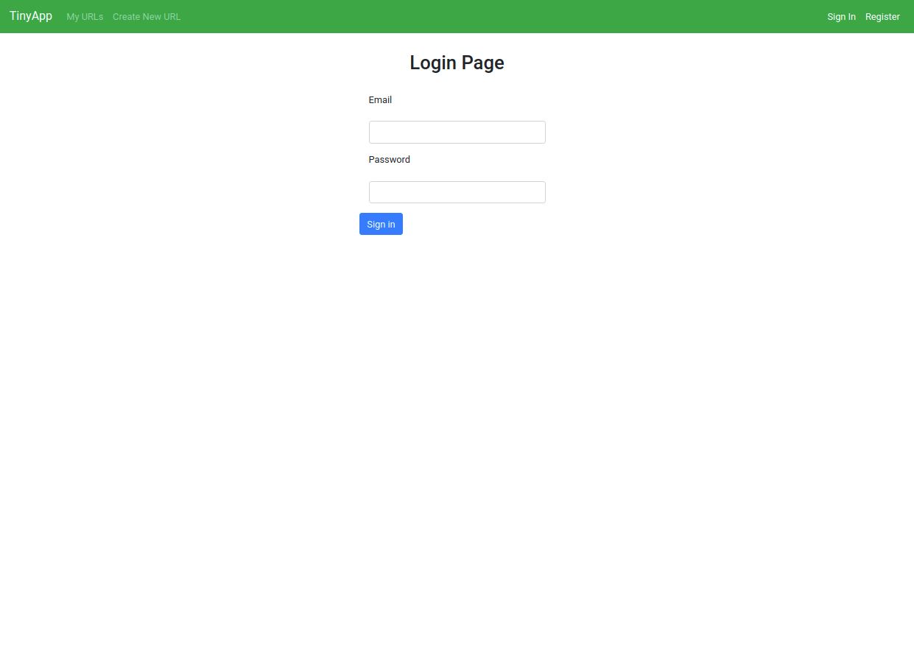
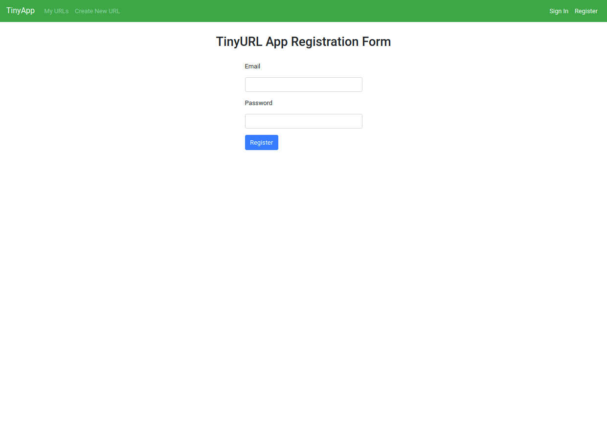
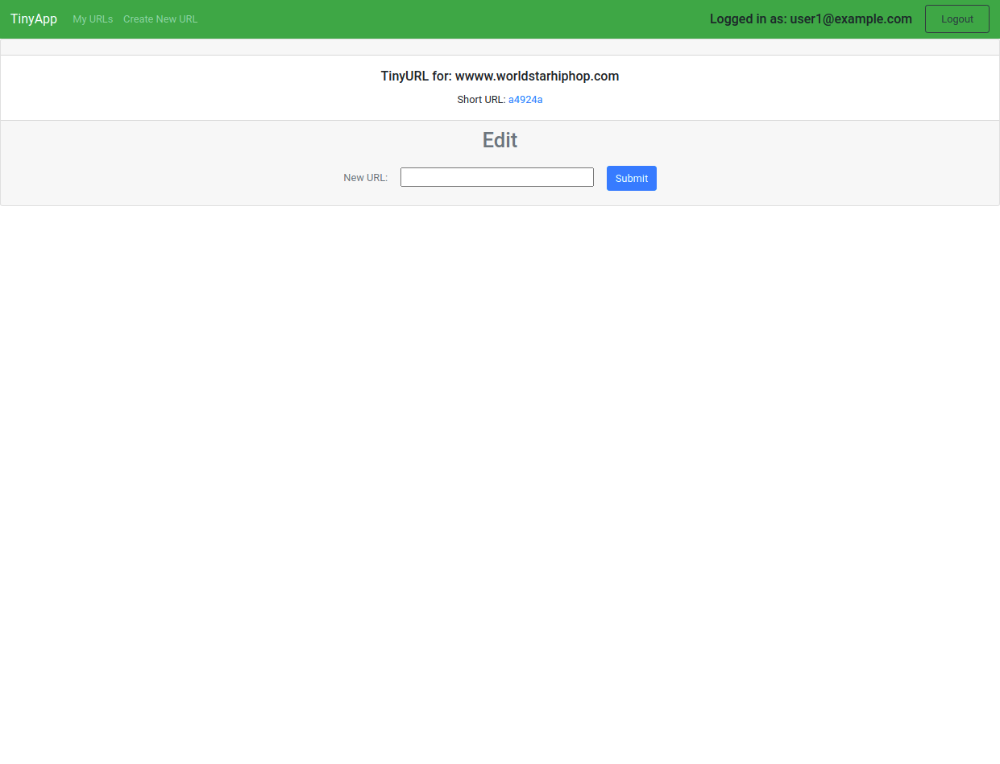
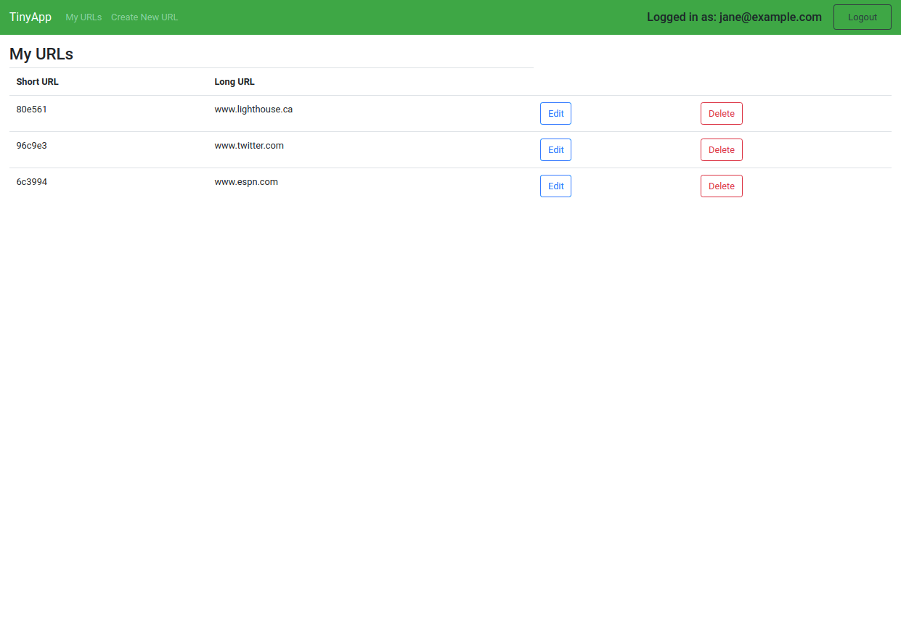

# TinyApp Project

TinyApp is a full stack web application built with Node and Express that allows users to shorten long URLs (à la bit.ly).

## Dependencies

- Node.js
- Express
- EJS
- bcrypt
- body-parser
- cookie-session
- uuidv4

## Getting Started

- Install all dependencies (using the `npm install` command).
- Run the development web server using the `node express_server.js` command or `npm start`.

## Screenshots

## Endpoints

http://localhost:8080/urls - directs to home page

http://localhost:8080/login - directs to login page. User is redirect to /urls endpoint if credentials are valid.

http://localhost:8080/register - directs user to a registration form. User is redirected to /urls endpoint if credentials are valid and do not already exist.

http://localhost:8080/urls/new - directs to create url page. Redirects to /:shortURL endpoint if successfully created
